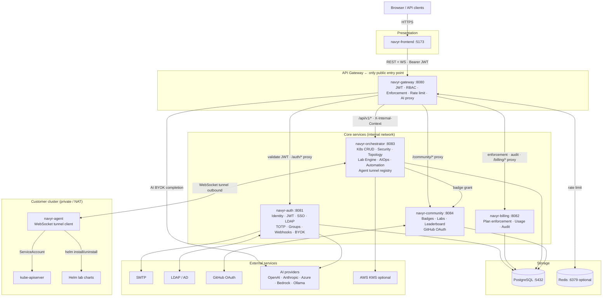

# Navyr — Technical Documentation

> **Navigate your runtime.**
> Navyr is a Kubernetes runtime operations platform powered by AI — not a dashboard, but an operations layer that observes, interprets, and acts on your infrastructure.

**Last updated: 2026-05-24**

---

## Table of contents

| Document | Description |
|---|---|
| [Architecture overview](docs/architecture.md) | System-wide architecture, service map, data flow |
| [Components](docs/components.md) | Each service: responsibility, repo, ports, dependencies |
| [Security architecture](docs/security.md) | Auth flow, RBAC, credential encryption, audit trail |
| [Agent tunnel](docs/agent-tunnel.md) | How clusters connect without exposing the API server |
| [API conventions](docs/api.md) | Auth, versioning, headers, error format, rate limiting |
| [Data model](docs/data.md) | Databases, schema overview, migration strategy |
| [Deployment](docs/deployment.md) | Docker Compose, Helm, Kustomize, production checklist |
| [Editions](docs/editions.md) | OSS / Enterprise / SaaS — feature boundaries and detection |
| [Operational Labs](docs/labs.md) | Fault injection engine — how labs work end to end |
| [Development guide](docs/development.md) | Local setup, env vars, test users, debugging |
| [Decisões de arquitetura (ADR)](docs/adr/README.md) | Por que o sistema é assim, e o que cada decisão custou |
| [Runbooks](docs/runbooks/README.md) | Procedimentos de operação sob incidente |
| [Achados em aberto](docs/achados-abertos.md) | Defeitos e riscos conhecidos ainda não corrigidos |
| [Roadmap](docs/roadmap.md) | Current status, phase overview, active backlog, recent deliveries |
| [Especificação de produto (legado)](docs/spec/ORIGEM.md) | Visão, personas e fluxos da fase KubeOps — histórico, **não** requisito vigente |

---

## Integrated architecture

> Full diagram: [docs/architecture.md → Integrated architecture diagram](docs/architecture.md#integrated-architecture-diagram)

---

## What is Navyr

Navyr is a **runtime operations platform** for Kubernetes — built for platform engineers, SREs, and DevOps teams who operate production clusters at scale.

The core premise is that operating Kubernetes requires more than visibility. Navyr acts on signals: it detects degradation, correlates events, surfaces security risks, and uses AI to suggest or execute remediation. Every feature is designed around the operational loop — observe → interpret → act.

### What Navyr is not

- Not a monitoring tool (it integrates with your existing Prometheus/Grafana stack)
- Not a deployment tool (it does not replace ArgoCD or Flux for GitOps)
- Not a raw kubectl wrapper (it adds semantic understanding on top of the Kubernetes API)

### Editions

| Edition | Audience | Distribution |
|---|---|---|
| **OSS** | Self-hosted, community users | Docker Compose / Helm, free |
| **Enterprise** | Teams with compliance, RBAC, and SSO requirements | Self-hosted with EE license |
| **SaaS** | Managed Navyr cloud | navyr.io (hosted) |

All editions share the same codebase. Edition capabilities are detected at
runtime based on license and configuration. See [Editions](docs/editions.md).

**Licensing.** Navyr is source-available under the
[Navyr Software License](LICENSE) — free for self-hosted non-commercial use,
education and OSS projects; commercial redistribution and hosting-as-a-service
require a separate agreement. It is **not** Apache 2.0. See
[EDITIONS.md](EDITIONS.md) for the full matrix of permitted scenarios and
[SECURITY.md](SECURITY.md) to report a vulnerability.

---

## Quick links

- [navyr-gateway](https://github.com/navyr-io/navyr-gateway) — API gateway `:8080`
- [navyr-auth](https://github.com/navyr-io/navyr-auth) — Auth service `:8081`
- [navyr-billing](https://github.com/navyr-io/navyr-billing) — Billing & enforcement `:8082`
- [navyr-orchestrator](https://github.com/navyr-io/navyr-orchestrator) — K8s ops engine `:8083`
- [navyr-community](https://github.com/navyr-io/navyr-community) — Community & labs `:8084`
- [navyr-frontend](https://github.com/navyr-io/navyr-frontend) — React SPA
- [navyr-agent](https://github.com/navyr-io/navyr-agent) — In-cluster agent
- [navyr-helm](https://github.com/navyr-io/navyr-helm) — Helm charts & lab scenarios
- [navyr-deploy](https://github.com/navyr-io/navyr-deploy) — Docker Compose quick-start
