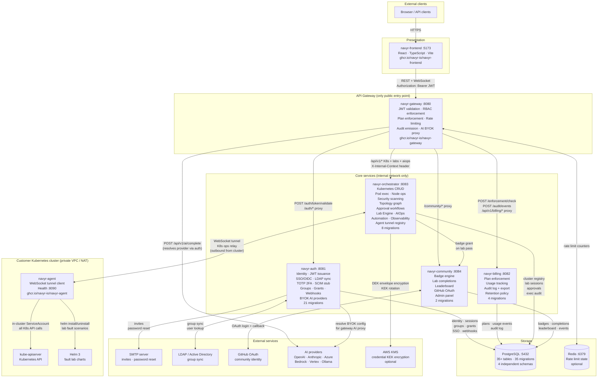

# Architecture overview

**Last updated: 2026-05-24**

## Integrated architecture diagram

The diagram below shows all Navyr components and every integration point between them — services, storage, in-cluster infrastructure, and external dependencies.



---

## System map

```
┌─────────────────────────────────────────────────────────────┐
│                        Browser / API clients                │
└───────────────────────────┬─────────────────────────────────┘
                            │ HTTP / WebSocket
                            ▼
┌─────────────────────────────────────────────────────────────┐
│                    navyr-gateway :8080                      │
│  JWT validate · RBAC enforce · plan enforce · audit emit   │
│  Rate limit (in-memory or Redis) · proxy + AI complete     │
└──────┬──────────┬──────────┬──────────┬────────────────────┘
       │          │          │          │
       ▼          ▼          ▼          ▼
  navyr-auth  navyr-billing  navyr-  navyr-community
   :8081       :8082        orchestrator  :8084
                             :8083
       │          │          │          │
       └──────────┴──────────┴──────────┘
                            │
                     PostgreSQL :5432
                    (shared database,
                     separate schemas
                     per service via
                     migration prefix)

                            │ WebSocket tunnel (outbound from cluster)
                            ▼
              ┌─────────────────────────┐
              │      navyr-agent        │
              │  (in customer cluster)  │
              └────────────┬────────────┘
                           │ in-cluster ServiceAccount
                           ▼
                    Kubernetes API server
```

## Request lifecycle

Every request from the browser goes through this sequence:

```
1. Browser → navyr-gateway
   - Attaches JWT as Authorization: Bearer <token>

2. Gateway → navyr-auth /auth/token/validate
   - Validates JWT signature and expiry
   - Returns org_id, user_id, role, permissions

3. Gateway → navyr-billing /billing/v1/enforcement/check
   - Checks if the org's plan allows this feature/action
   - Returns allow / deny / degraded

4. Gateway → downstream service (auth / orchestrator / billing / community)
   - Attaches X-Internal-Context (signed HMAC-SHA256 header)
   - Contains: org_id, user_id, role, cluster_id, permissions

5. Downstream service processes request
   - Reads X-Internal-Context instead of re-validating JWT
   - No service calls the Kubernetes API directly

6. Gateway → navyr-billing (async, non-blocking)
   - Emits audit event for write operations

7. Response flows back to browser
```

## Service responsibilities

| Service | Port | Primary role |
|---|---|---|
| `navyr-gateway` | `8080` | Entry point, auth enforcement, routing |
| `navyr-auth` | `8081` | Identity, JWT, RBAC, SSO, LDAP, 2FA, BYOK AI |
| `navyr-billing` | `8082` | Plan enforcement, usage tracking, audit log |
| `navyr-orchestrator` | `8083` | All Kubernetes operations via agent tunnel |
| `navyr-community` | `8084` | Labs, badges, GitHub identity, leaderboard |
| `navyr-frontend` | `5173` | React SPA, served via nginx in production |
| `navyr-agent` | outbound | In-cluster relay — connects to orchestrator |

## Network topology

```
Internet
    │
    ▼
navyr-gateway :8080          ← only service exposed externally
    │
Internal Docker/K8s network:
    ├── navyr-auth :8081
    ├── navyr-billing :8082
    ├── navyr-orchestrator :8083
    │       │
    │       │ WebSocket (outbound from cluster)
    │       ◄─── navyr-agent (in customer cluster)
    │                │
    │                └── Kubernetes API (in-cluster)
    └── navyr-community :8084
            │
            └── GitHub OAuth (external)

Shared:
    PostgreSQL :5432
    Redis :6379 (optional, rate limiting)
```

## Horizontal scaling considerations

| Service | Stateful? | Scale notes |
|---|---|---|
| `navyr-gateway` | No | Scales horizontally; Redis required for distributed rate limiting |
| `navyr-auth` | No | Scales horizontally; sticky sessions not required (JWT is stateless) |
| `navyr-billing` | No | Scales horizontally |
| `navyr-orchestrator` | Partially | Agent tunnel WebSocket connections are per-process; use sticky routing or a message broker for multi-instance |
| `navyr-community` | No | Scales horizontally |
| PostgreSQL | Yes | Primary + read replicas; use PgBouncer for connection pooling |

## Inter-service communication

All services communicate over plain HTTP/1.1 within the internal network. Authentication between services uses the `X-Internal-Context` header — a compact signed JSON payload that carries the authorized identity context from the gateway.

```
X-Internal-Context: <base64(json)>.<hmac-sha256-signature>

Payload fields:
  org_id      string   — organization UUID
  user_id     string   — user UUID
  role        string   — effective role (owner/admin/operator/viewer)
  cluster_id  string   — target cluster UUID (if scoped)
  permissions []string — allowed action list
  issued_at   int64    — Unix timestamp
```

Services **reject** requests without a valid `X-Internal-Context`. This prevents bypassing the gateway entirely.
